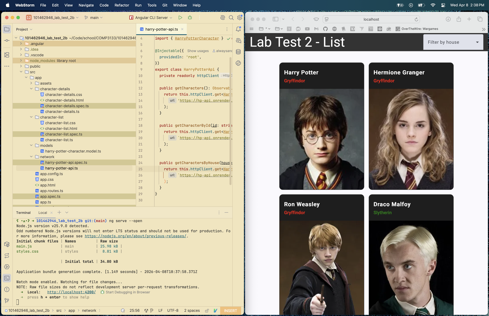
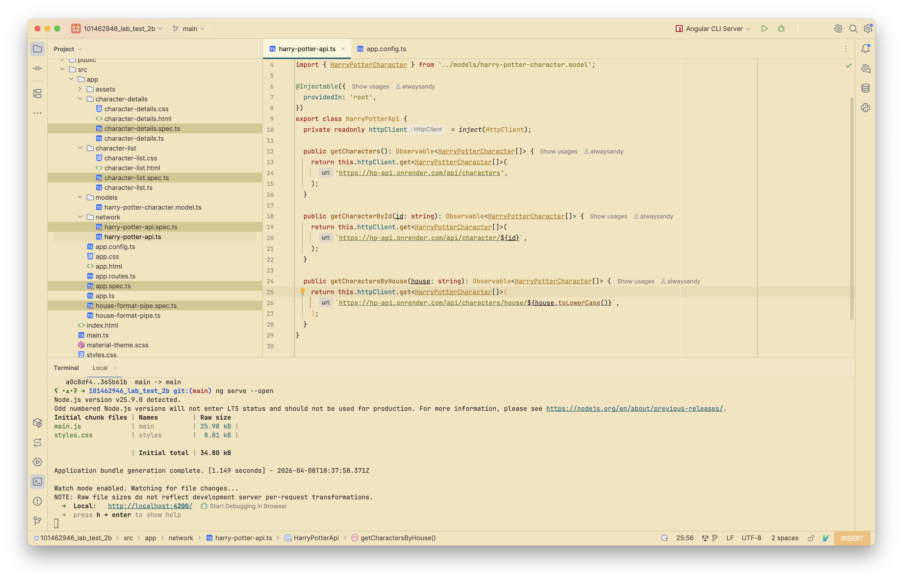
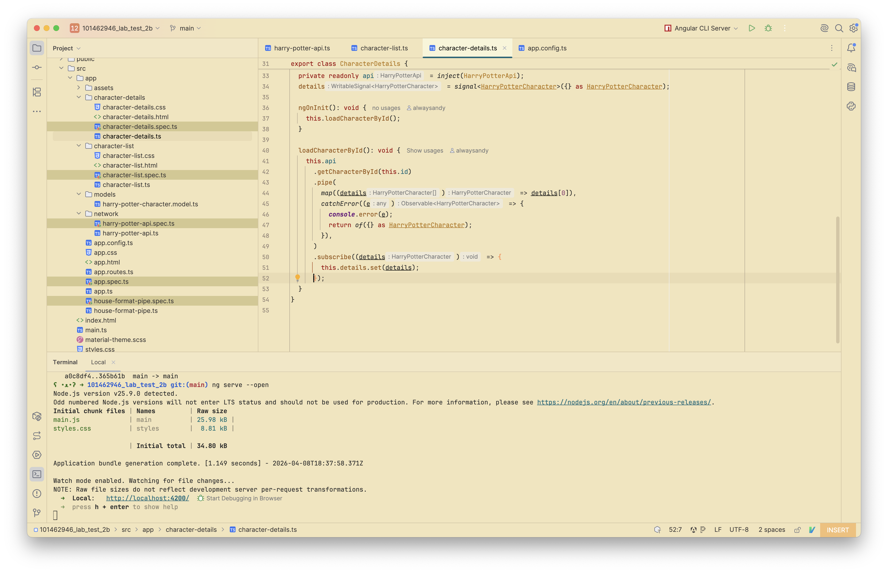
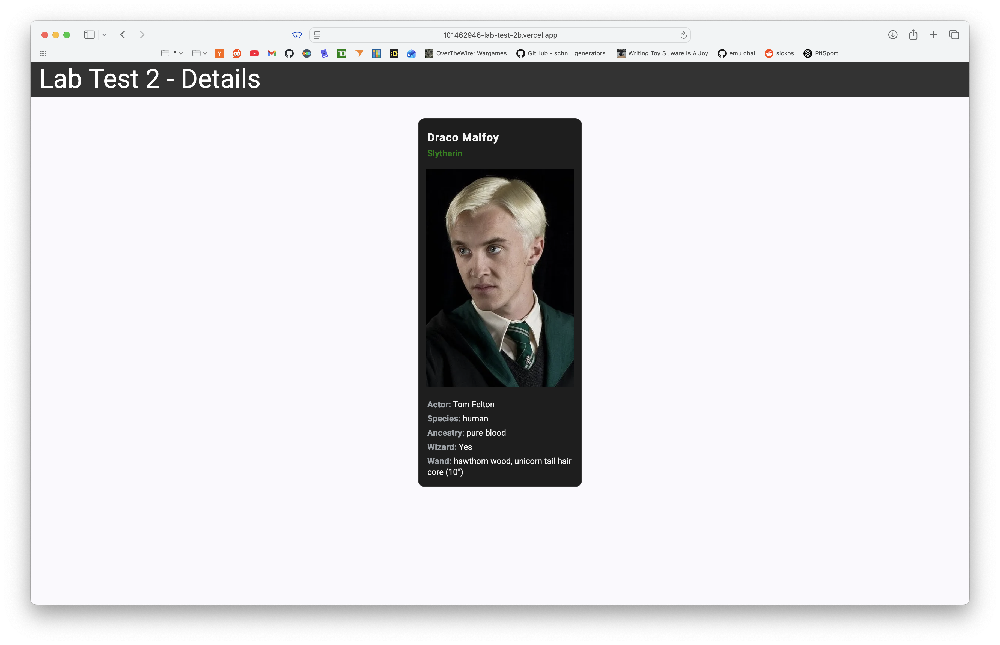

# **101462946 Lab Test 2b**

This is an Angular app that fetches all Harry Potter characters, and shows a picture of them and some of the character details in a grid. Users can filter by house, or click on the character to see further details about the.

---

## **Features implemented**

* Fetch all character information via **HTTPClient Service**
* Display all characters in a grid with basic styling
* Allow clicking character to see details using **get character by id** endpoint
* Allow filtering by house from dropdown using **get character by house** endpoint
* Use **Angular Pipe** to change color of house

---

## **How to run**

1. Clone this app:

   ```bash
   git clone https://github.com/alwaysandy/101462946_lab_test_2b.git
   ```
2. Change directory:

   ```bash
   cd 101462946_lab_test_2b
   ```
3. Install dependencies:

   ```bash
   npm install
   ```
4. Run the development server:

   ```bash
   ng serve --open
   ```
5. The app will automatically open in your browser at:
   http://localhost:4200

---

## **Screenshots**

### App Running


### Api Service / Code




### App Running

#### Character List


#### Filtering Characters By House


#### Character Details

